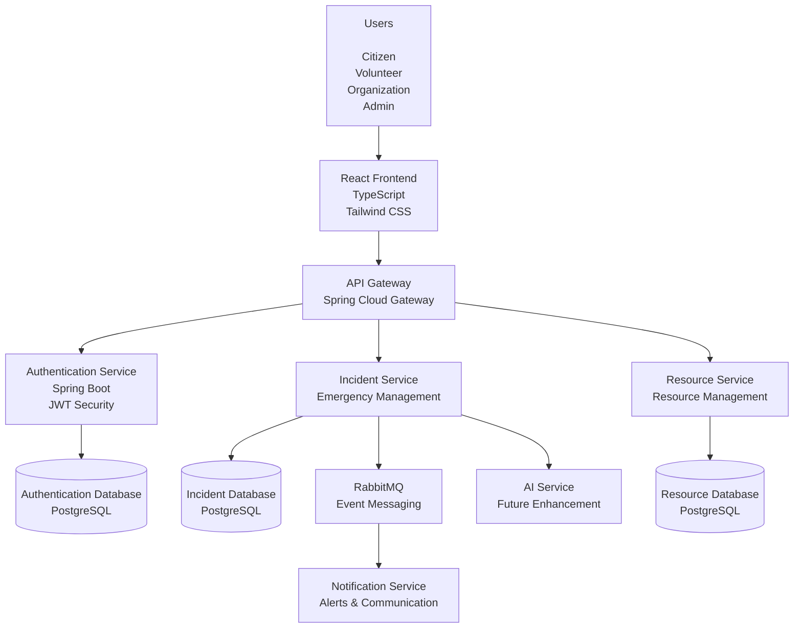
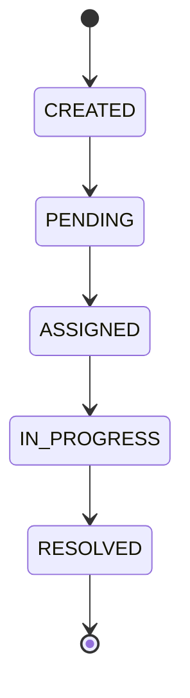
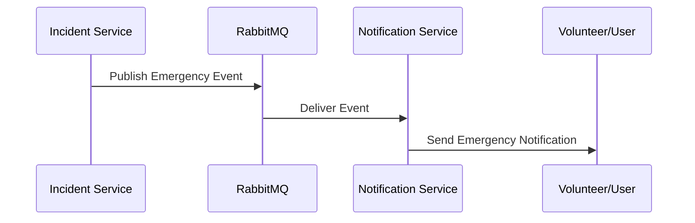
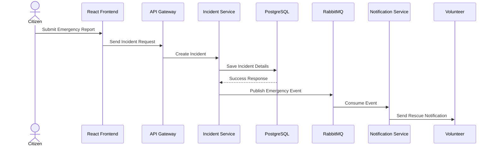
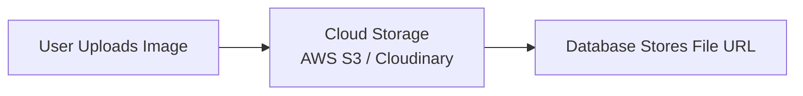
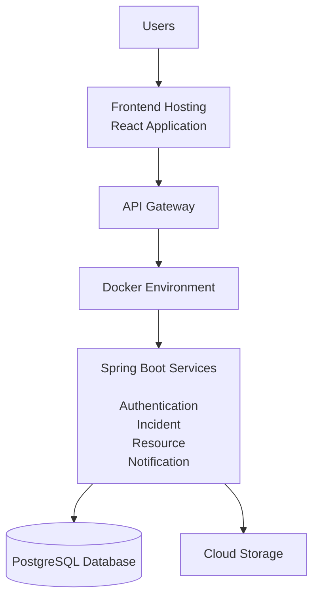

# ResQNet - System Architecture Document

## 1. Introduction

ResQNet is an AI-powered Disaster Response and Emergency Coordination Platform designed to improve communication and coordination between citizens, volunteers, organizations, and authorities during emergency situations.

The platform follows a **Hybrid Microservices Architecture** to achieve:

- Scalability
- Maintainability
- Clear separation of responsibilities
- Better fault isolation
- Enterprise-level design practices

---

# 2. High-Level System Architecture

The overall architecture of ResQNet consists of:

- React-based frontend application
- API Gateway
- Independent backend services
- PostgreSQL databases
- Message broker for asynchronous communication
- AI service for future intelligent features




---

# 3. Architecture Style

## Hybrid Microservices Architecture

ResQNet uses a hybrid microservices approach.

Instead of creating many small services, only major business domains are separated.

This provides:

- Real-world enterprise architecture experience
- Easier development and debugging
- Independent scalability of important modules


---

# 4. Frontend Layer

## Technology Stack

- React
- TypeScript
- Tailwind CSS
- Axios
- React Router


## Responsibilities

The frontend application provides role-based interfaces for:

### Citizen Dashboard

Features:

- Report emergency incidents
- Share location
- Upload images
- Track rescue status


### Volunteer Dashboard

Features:

- View available rescue requests
- Accept assignments
- Update mission status


### Organization Dashboard

Features:

- Manage resources
- Update availability
- Provide emergency support


### Admin Dashboard

Features:

- Monitor all incidents
- Manage users
- View analytics

---

# 5. Backend Services

## 5.1 API Gateway

Technology:

- Spring Cloud Gateway


The API Gateway acts as the single entry point between the frontend and backend services.


Responsibilities:

- Request routing
- Authentication filtering
- API security
- Centralized request handling


Example:


```
Frontend

   |

API Gateway

   |

--------------------------------

Auth Service

Incident Service

Resource Service
```

---

# 5.2 Authentication Service

## Purpose

Responsible for user identity and access management.


Responsibilities:

- User registration
- Login authentication
- Password encryption
- JWT token generation
- Role-based authorization


User Roles:

```
CITIZEN

VOLUNTEER

ORGANIZATION

ADMIN
```


Database Entities:

- User
- Role
- Permission


---

# 5.3 Incident Management Service

## Purpose

The core service responsible for managing disaster incidents.


Responsibilities:

- Create emergency reports
- Store incident information
- Track incident lifecycle
- Assign volunteers
- Update rescue progress


Incident Lifecycle:



Database Entities:

- Incident
- Assignment
- Location


---

# 5.4 Resource Management Service

## Purpose

Manages emergency resources provided by organizations.


Resources include:

- Food supplies
- Water supplies
- Medicines
- Ambulances
- Hospital beds
- Shelters


Responsibilities:

- Add resources
- Update availability
- Track resource usage


Database Entities:

- Organization
- Resource


---

# 5.5 Notification Service

## Purpose

Handles emergency communication.


Responsibilities:

- Send alerts
- Notify volunteers
- Broadcast critical incidents
- Provide real-time updates


Technology:

- RabbitMQ
- WebSockets


Communication Flow:




---

# 5.6 AI Service (Future Enhancement)

The AI service will provide intelligent assistance.


Possible Features:

- Automatic disaster classification
- Emergency report summarization
- Image-based damage detection
- AI chatbot assistant
- Priority prediction


Possible Technologies:

- Machine Learning Models
- Large Language Models
- Computer Vision


---

# 6. Incident Creation Workflow

Example scenario:

A citizen reports a flood emergency.




---

# 7. Database Architecture

The system uses PostgreSQL as the primary database.


## Authentication Database

Stores:

- Users
- Roles
- Permissions


## Incident Database

Stores:

- Emergency incidents
- Assignments
- Locations


## Resource Database

Stores:

- Organizations
- Resources
- Availability


Future improvement:

Each service can have its own independent database.

---

# 8. File Storage Architecture

Images and documents uploaded during incidents will not be stored directly inside PostgreSQL.


Flow:




---

# 9. Deployment Architecture


The application will be containerized using Docker.




---

# 10. Security Architecture

Security mechanisms:


## Authentication

- JWT based authentication
- Secure password hashing using BCrypt


## Authorization

- Role-based access control


## API Security

- Request validation
- Secure endpoints
- Protection against unauthorized access


## Data Security

- Environment variables for secrets
- Secure file uploads

---

# 11. Future Scalability Improvements

Future enhancements:

- Redis caching
- Elasticsearch search engine
- Kubernetes deployment
- Mobile application
- Weather API integration
- Satellite data integration
- AI-powered disaster prediction
- Real-time location tracking


---

# 12. Conclusion

ResQNet is designed as a scalable and enterprise-ready disaster response platform.

The architecture focuses on:

- Reliability
- Security
- Scalability
- Maintainability
- Real-world emergency coordination

This design allows future expansion with AI, real-time communication, and large-scale deployment capabilities.