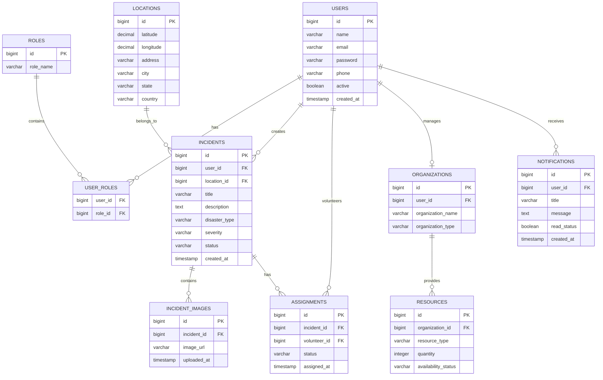
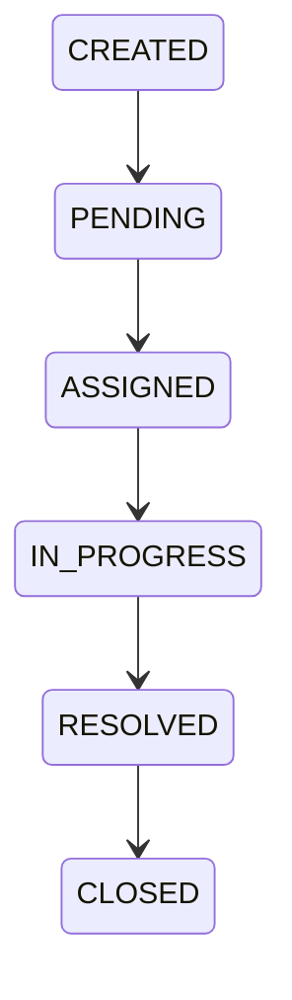

# ResQNet - Database Design Document

## 1. Introduction

This document describes the database design for the ResQNet Disaster Response and Emergency Coordination Platform.

The system uses a relational database model with PostgreSQL as the primary database.

The database design focuses on:

- Data consistency
- Scalability
- Security
- Efficient querying
- Support for future AI and analytics features

---

# 2. Database Strategy

ResQNet follows a service-oriented database approach.

Each major service owns its business data.

Initial implementation:

```
PostgreSQL Database

        |

---------------------------------

Authentication Data

Incident Data

Resource Data

Notification Data
```

Future improvement:

Each microservice can have its own independent database.

---

# 3. Entity Relationship Diagram



---

# 4. Authentication Module

## Users Table

Purpose:

Stores all registered users of the platform.


Table:

```
users
```

Columns:

| Column | Type | Description |
|---|---|---|
| id | BIGINT | Primary key |
| name | VARCHAR | User full name |
| email | VARCHAR | Unique email |
| password | VARCHAR | Encrypted password |
| phone | VARCHAR | Contact number |
| active | BOOLEAN | Account status |
| created_at | TIMESTAMP | Registration time |


---

## Roles Table

Purpose:

Stores available system roles.


Table:

```
roles
```


Example data:

| id | role_name |
|-|-|
|1|CITIZEN|
|2|VOLUNTEER|
|3|ORGANIZATION|
|4|ADMIN|


---

## User Roles Table

Purpose:

Creates many-to-many relationship between users and roles.


Example:

A user can have:

```
Allen

Roles:

VOLUNTEER
ADMIN
```

---

# 5. Incident Management Module

## Incidents Table

Purpose:

Stores emergency reports created by citizens.


Table:

```
incidents
```


Columns:

| Column | Type | Description |
|-|-|-|
| id | BIGINT | Primary key |
| user_id | BIGINT | Citizen who created incident |
| location_id | BIGINT | Incident location |
| title | VARCHAR | Incident title |
| description | TEXT | Detailed information |
| disaster_type | VARCHAR | Flood, Fire, Earthquake |
| severity | VARCHAR | LOW, MEDIUM, HIGH, CRITICAL |
| status | VARCHAR | Current incident state |
| created_at | TIMESTAMP | Creation time |


---

## Incident Status Flow



---

## Incident Images Table

Purpose:

Stores uploaded image references.

Important:

Images are not stored directly in PostgreSQL.

Only URLs are stored.

Example:

```
incident_images

id:
1

image_url:
https://storage.com/flood-image.jpg
```

---

# 6. Volunteer Assignment Module

## Assignments Table

Purpose:

Connects volunteers with emergency incidents.


Columns:

| Column | Type |
|-|-|
| id | BIGINT |
| incident_id | BIGINT |
| volunteer_id | BIGINT |
| status | VARCHAR |
| assigned_at | TIMESTAMP |


Example:

```
Incident:

Flood Rescue


Assigned Volunteer:

John


Status:

IN_PROGRESS
```

---

# 7. Resource Management Module

## Organizations Table

Purpose:

Stores organizations providing emergency support.


Examples:

- Hospitals
- NGOs
- Relief Centers


Columns:

| Column | Type |
|-|-|
| id | BIGINT |
| user_id | BIGINT |
| organization_name | VARCHAR |
| organization_type | VARCHAR |


---

## Resources Table

Purpose:

Stores available emergency resources.


Examples:

```
Medicine

Food Packets

Ambulances

Hospital Beds
```


Columns:

| Column | Type |
|-|-|
| id | BIGINT |
| organization_id | BIGINT |
| resource_type | VARCHAR |
| quantity | INTEGER |
| availability_status | VARCHAR |

---

# 8. Location Management Module

## Locations Table

Purpose:

Stores geographical information.


Columns:

| Column | Type |
|-|-|
| id | BIGINT |
| latitude | DECIMAL |
| longitude | DECIMAL |
| address | VARCHAR |
| city | VARCHAR |
| state | VARCHAR |
| country | VARCHAR |


Future usage:

- Maps integration
- Distance calculation
- Nearby volunteer search

---

# 9. Notification Module

## Notifications Table

Purpose:

Stores system notifications.


Examples:

- New rescue request
- Incident assignment
- Emergency alerts


Columns:

| Column | Type |
|-|-|
| id | BIGINT |
| user_id | BIGINT |
| title | VARCHAR |
| message | TEXT |
| read_status | BOOLEAN |
| created_at | TIMESTAMP |

---

# 10. Database Security Considerations

Security practices:

- Passwords stored using BCrypt hashing
- Sensitive data encrypted
- Database credentials stored using environment variables
- Role-based data access
- Input validation before persistence

---

# 11. Future Database Improvements

Possible improvements:

- PostGIS extension for advanced geographical queries
- Redis caching
- Elasticsearch for incident search
- Time-series database for disaster analytics
- Data warehouse for AI predictions


---

# 12. Conclusion

The ResQNet database design provides a strong foundation for building a scalable disaster response platform.

The design supports:

- Secure authentication
- Emergency incident management
- Volunteer coordination
- Resource tracking
- Real-time notifications
- Future AI capabilities